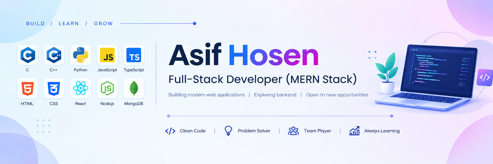

<!--- banner --->

 

<!--- title --->

  <ul align="center">
    
<h1 style="display: inline-block">Hi 👋, I'm Asif Hosen</h1>

    <!--- typo --->
    
  </ul>

 

<!--- about --->
- 👋 Hi, I'm **Asif Hosen**, an aspiring Full-Stack Developer.
- 🚀 Currently learning and building projects with the **MERN Stack**.
- 💻 Working with **React, JavaScript, TypeScript, Node.js, Express.js, and MongoDB**.
- 🎨 Building modern and responsive interfaces with **HTML, CSS, Tailwind CSS, and Bootstrap**.
- 🧠 Programming foundation in **C, C++, and Python**.
- 🔐 Exploring **Backend Development, REST APIs, Authentication, and Database Design**.
- 💡 I enjoy **problem-solving** and turning ideas into real-world applications.
- 🌱 Continuously learning and improving my **software development skills**.
- 🎯 Interested in **Full-Stack, Backend, and Software Development**.
  
 

<!--- socials --->
## <b> FOLLOW ME ON SOCIALS:</b>

  

    
    
  

 

<!--- technology --->
##  <b> TECHNOLOGY STACK:</b>

### Languages:

### CSS Frameworks & Libraries:

### JavaScript Frameworks & Libraries:

### Database & Model:

### Deployment Platform:

### Design & Graphics:

### Tools & Technologies:

 

<!--- statistics --->
## <b> GITHUB STATISTICS & ANALYSIS:</b>

### 🐍 GitHub Contributions

<!--
### GitHub Statistics:
|  |  |
| ------------- | ------------- |

### Repository Stats & Streak:
|  |  |
| ------------- | ------------- |
-->

 

<!--- random quote --->
##  <b> RANDOM DEV QUOTE:</b>

---

<!--- visit count --->
<!--

  

-->
